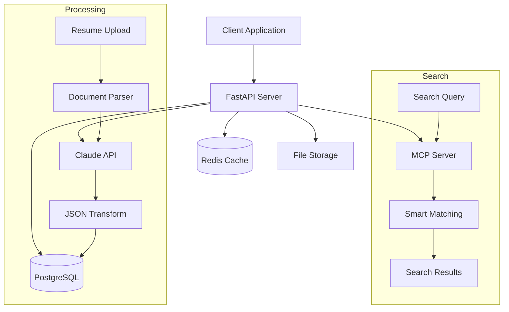

# HR Resume Search MCP API

[](https://github.com/petmar2017/hr-resume-search-mcp)
[](https://www.python.org/)
[](https://fastapi.tiangolo.com/)
[](LICENSE)

An intelligent resume search and matching system with Model Context Protocol (MCP) integration for advanced HR analytics.

**Repository**: [https://github.com/petmar2017/hr-resume-search-mcp](https://github.com/petmar2017/hr-resume-search-mcp)

## 🎯 Overview

This API provides intelligent resume search capabilities, allowing HR teams to:
- Search for candidates with similar backgrounds
- Find candidates from the same department/desk
- Discover professional networks and connections
- Upload and process resumes in multiple formats (PDF, DOC, DOCX)
- Transform unstructured resume data into standardized JSON using Claude AI

## 🚀 Quick Start

```bash
# Setup environment
make setup

# Run the application
make dev

# Run tests
make test

# View API documentation
open http://localhost:8000/docs
```

## 🏗️ Architecture



## 📚 Documentation

- [API Documentation](./api.md) - Complete API reference
- [Architecture](./architecture.md) - System design and components
- [Quick Start Guide](./quickstart.md) - Setup and running instructions
- [Implementation Plan](./implementation_plan.md) - Development roadmap
- [Deployment Guide](./docs/deployment.md) - Production deployment
- [Testing Strategy](./docs/testing.md) - Test coverage and strategies

## 🛠️ Technology Stack

- **Framework**: FastAPI 0.104.1
- **Database**: PostgreSQL with SQLAlchemy ORM
- **Cache**: Redis for performance optimization
- **Authentication**: JWT-based authentication
- **File Processing**: PDF, DOC, DOCX support
- **AI Integration**: Claude API for resume parsing
- **MCP Integration**: Smart search and query capabilities

## 📋 Features

### Core Features
- ✅ Resume upload and processing (PDF, DOC, DOCX)
- ✅ AI-powered resume parsing with Claude
- ✅ Standardized JSON schema for resume data
- ✅ JWT authentication and authorization
- ✅ Rate limiting and caching
- ✅ Comprehensive API documentation

### Search Capabilities
- 🔍 Similar candidate search
- 🔍 Department/desk matching
- 🔍 Professional network discovery
- 🔍 Skills and experience matching
- 🔍 Advanced query filtering

### MCP Tools
- Database query optimization
- Intelligent search algorithms
- API testing utilities
- Smart HR database queries

## 🔧 Development

### Prerequisites
- Python 3.12 (REQUIRED - DO NOT USE 3.13)
- PostgreSQL
- Redis
- uv package manager

### Environment Setup

```bash
# Create virtual environment
uv venv --python /opt/homebrew/bin/python3.12
source .venv/bin/activate

# Install dependencies
uv pip install -r requirements.txt
uv pip install -r requirements-dev.txt

# Setup environment variables
cp .env.example .env
# Edit .env with your configuration
```

### Make Commands

```bash
make help          # Show all available commands
make setup         # Complete project setup
make dev           # Run in development mode
make test          # Run all tests
make test-coverage # Run tests with coverage
make lint          # Run code linting
make format        # Format code
make docker-build  # Build Docker image
make docker-run    # Run in Docker
make deploy        # Deploy to Kubernetes
```

## 🧪 Testing

```bash
# Run all tests
make test

# Run with coverage
make test-coverage

# Run specific test types
pytest tests/unit/
pytest tests/integration/
pytest tests/e2e/
```

Target coverage: 80%

## 📊 Monitoring

- **Prometheus**: Metrics collection at `http://localhost:9090`
- **Grafana**: Dashboards at `http://localhost:3000`
- **Loki**: Log aggregation at `http://localhost:3100`
- **Tempo**: Distributed tracing at `http://localhost:3200`

## 🚀 Deployment

See [Deployment Guide](./docs/deployment.md) for detailed instructions.

## 📝 API Endpoints

### Health Checks
- `GET /` - Root endpoint
- `GET /health` - Health check
- `GET /readiness` - Readiness check

### Resume Management
- `POST /api/v1/resumes/upload` - Upload resume
- `GET /api/v1/resumes/{id}` - Get resume details
- `GET /api/v1/resumes/search` - Search resumes

### Authentication
- `POST /api/v1/auth/login` - User login
- `POST /api/v1/auth/refresh` - Refresh token
- `POST /api/v1/auth/logout` - User logout

See [API Documentation](./api.md) for complete reference.

## 🔒 Security

- JWT-based authentication
- Rate limiting on all endpoints
- Input validation and sanitization
- SQL injection prevention
- CORS configuration
- Environment-based secrets management

## 📄 License

[License information here]

## 👥 Contributors

[Contributors list here]