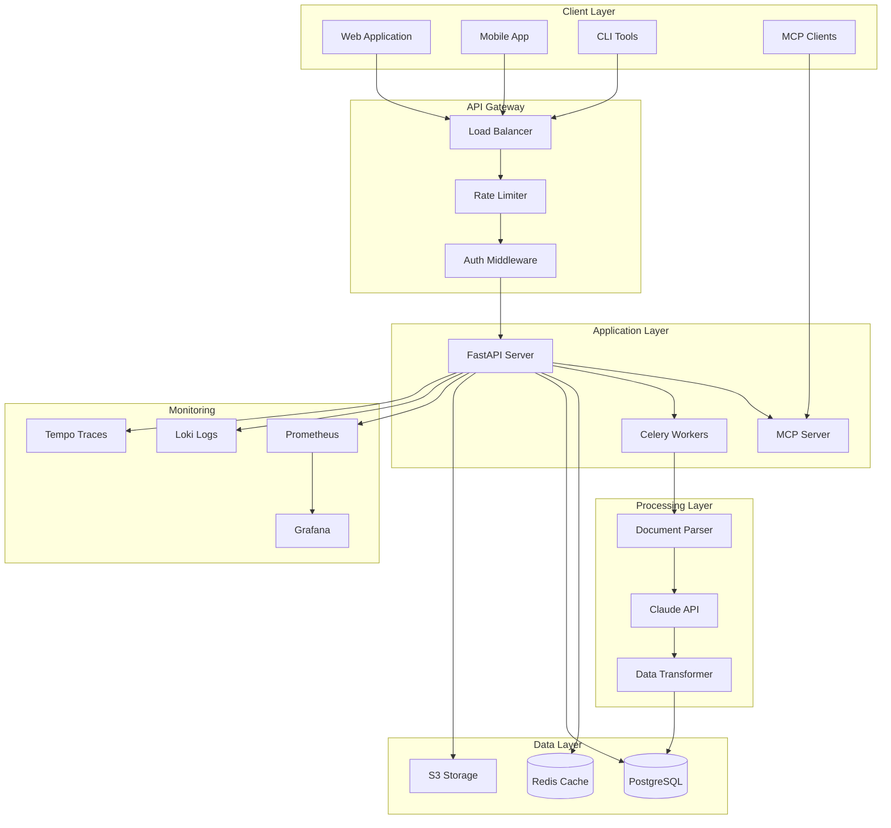
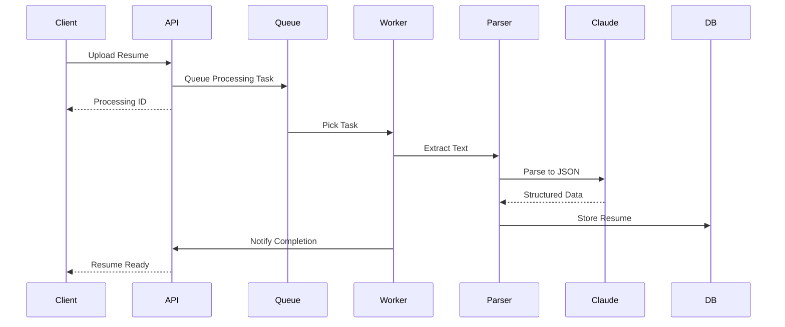
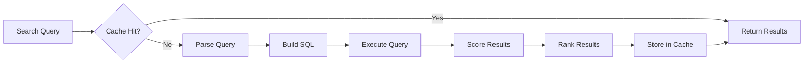
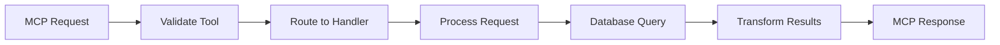
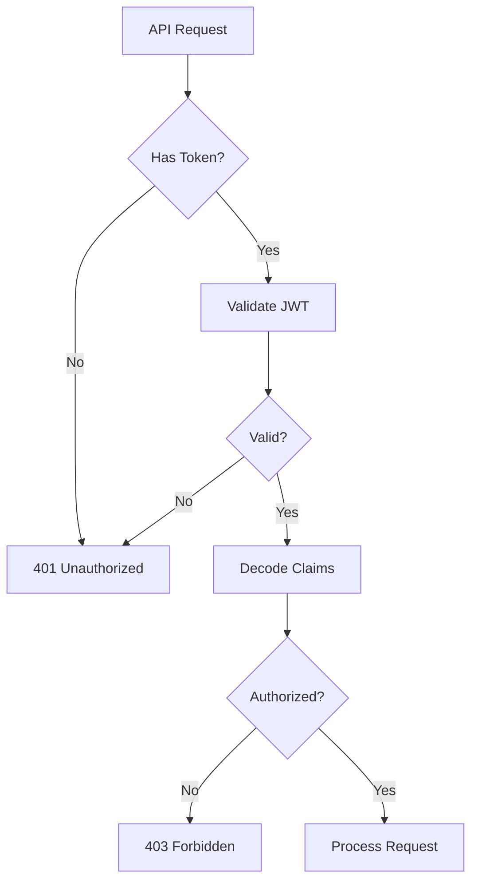
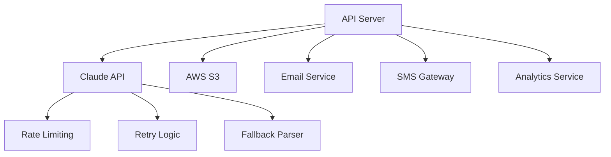
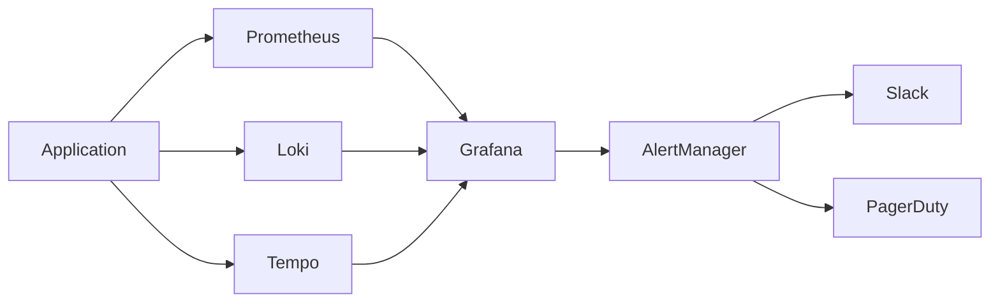
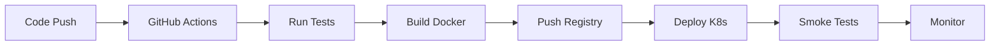

# System Architecture - HR Resume Search MCP API

## 🏗️ High-Level Architecture



## 📦 Component Architecture

### 1. Client Layer
- **Web Application**: React/TypeScript frontend
- **Mobile App**: React Native or native apps
- **CLI Tools**: Command-line interfaces for automation
- **MCP Clients**: Claude Desktop and other MCP-compatible clients

### 2. API Gateway
- **Load Balancer**: Nginx or AWS ALB for traffic distribution
- **Rate Limiter**: Redis-based rate limiting
- **Auth Middleware**: JWT validation and authorization

### 3. Application Layer

#### FastAPI Server
```python
app/
├── api/
│   ├── __init__.py
│   ├── auth.py          # Authentication endpoints
│   ├── resumes.py       # Resume management
│   ├── search.py        # Search endpoints
│   └── stats.py         # Analytics endpoints
├── core/
│   ├── config.py        # Configuration management
│   ├── security.py      # Security utilities
│   └── database.py      # Database connection
├── models/
│   ├── resume.py        # SQLAlchemy models
│   ├── user.py          # User models
│   └── search.py        # Search models
├── schemas/
│   ├── resume.py        # Pydantic schemas
│   ├── auth.py          # Auth schemas
│   └── search.py        # Search schemas
├── services/
│   ├── parser.py        # Document parsing
│   ├── claude.py        # Claude API integration
│   ├── search.py        # Search algorithms
│   └── cache.py         # Caching logic
└── main.py              # Application entry point
```

#### MCP Server
```python
mcp_server/
├── __init__.py
├── server.py            # MCP server implementation
├── tools/
│   ├── search.py        # Search tools
│   ├── query.py         # Database query tools
│   └── analytics.py     # Analytics tools
└── handlers.py          # Request handlers
```

### 4. Processing Layer

#### Document Processing Pipeline


### 5. Data Layer

#### Database Schema
```sql
-- Core Tables
CREATE TABLE candidates (
    id UUID PRIMARY KEY DEFAULT gen_random_uuid(),
    name VARCHAR(255) NOT NULL,
    email VARCHAR(255) UNIQUE,
    phone VARCHAR(50),
    location VARCHAR(255),
    created_at TIMESTAMP DEFAULT CURRENT_TIMESTAMP,
    updated_at TIMESTAMP DEFAULT CURRENT_TIMESTAMP
);

CREATE TABLE resume_data (
    id UUID PRIMARY KEY DEFAULT gen_random_uuid(),
    candidate_id UUID REFERENCES candidates(id),
    json_data JSONB NOT NULL,
    original_format VARCHAR(10),
    file_path VARCHAR(500),
    parsed_at TIMESTAMP,
    confidence_score DECIMAL(3,2),
    processing_version VARCHAR(20)
);

CREATE TABLE work_experience (
    id UUID PRIMARY KEY DEFAULT gen_random_uuid(),
    candidate_id UUID REFERENCES candidates(id),
    company VARCHAR(255),
    position VARCHAR(255),
    department VARCHAR(255),
    desk VARCHAR(255),
    start_date DATE,
    end_date DATE,
    is_current BOOLEAN DEFAULT FALSE,
    description TEXT,
    INDEX idx_company (company),
    INDEX idx_department_desk (department, desk)
);

CREATE TABLE skills (
    id UUID PRIMARY KEY DEFAULT gen_random_uuid(),
    name VARCHAR(100) UNIQUE NOT NULL,
    category VARCHAR(50),
    INDEX idx_name (name)
);

CREATE TABLE candidate_skills (
    candidate_id UUID REFERENCES candidates(id),
    skill_id UUID REFERENCES skills(id),
    proficiency_level VARCHAR(20),
    years_experience INTEGER,
    PRIMARY KEY (candidate_id, skill_id)
);

CREATE TABLE connections (
    candidate_id UUID REFERENCES candidates(id),
    connected_candidate_id UUID REFERENCES candidates(id),
    relationship_type VARCHAR(50),
    company VARCHAR(255),
    overlap_start DATE,
    overlap_end DATE,
    PRIMARY KEY (candidate_id, connected_candidate_id),
    INDEX idx_relationship (relationship_type)
);

-- Search optimization indexes
CREATE INDEX idx_candidates_email ON candidates(email);
CREATE INDEX idx_work_exp_dates ON work_experience(start_date, end_date);
CREATE INDEX idx_candidate_skills_composite ON candidate_skills(skill_id, proficiency_level);
CREATE INDEX idx_resume_data_parsed ON resume_data(parsed_at);

-- Full-text search
CREATE INDEX idx_resume_fulltext ON resume_data USING GIN (json_data);
```

#### Redis Cache Structure
```
Keys:
- session:{user_id}             # User sessions
- token:{jti}                   # JWT tokens
- search:{hash}                 # Search results cache
- resume:{id}                   # Resume data cache
- rate:{user_id}:{endpoint}     # Rate limiting
- processing:{id}               # Processing status
- stats:overview                # Statistics cache
```

## 🔄 Data Flow Architecture

### 1. Resume Upload Flow

```mermaid
graph LR
    Upload[File Upload] --> Validate[Validation]
    Validate --> Store[S3 Storage]
    Store --> Queue[Task Queue]
    Queue --> Parse[Parse Document]
    Parse --> Extract[Extract Text]
    Extract --> Claude[Claude API]
    Claude --> Transform[Transform JSON]
    Transform --> Enrich[Enrich Data]
    Enrich --> Save[Save to DB]
    Save --> Index[Update Indexes]
    Index --> Cache[Update Cache]
    Cache --> Notify[Notify Client]
```


### 2. Search Flow


### 3. MCP Integration Flow


## 🛡️ Security Architecture

### Authentication & Authorization


### Security Layers
1. **Network Security**
   - HTTPS/TLS encryption
   - Firewall rules
   - DDoS protection

2. **Application Security**
   - JWT authentication
   - Role-based access control
   - Input validation
   - SQL injection prevention
   - XSS protection

3. **Data Security**
   - Encryption at rest
   - Encryption in transit
   - PII data masking
   - Audit logging

## 📊 Scalability Architecture

### Horizontal Scaling Strategy
```yaml
components:
  api_servers:
    min_replicas: 3
    max_replicas: 10
    scale_metric: cpu_utilization
    target_value: 70%
  
  workers:
    min_replicas: 2
    max_replicas: 20
    scale_metric: queue_length
    target_value: 100
  
  database:
    primary: 1
    read_replicas: 2
    connection_pool: 100
  
  redis:
    mode: cluster
    nodes: 3
    replicas: 1
```

### Performance Optimization
1. **Caching Strategy**
   - L1: Application memory cache (5 minutes)
   - L2: Redis cache (30 minutes)
   - L3: CDN for static assets

2. **Database Optimization**
   - Connection pooling
   - Query optimization
   - Indexes on search fields
   - Partitioning for large tables

3. **Async Processing**
   - Background jobs for heavy processing
   - Event-driven architecture
   - Message queuing with Celery

## 🔌 Integration Architecture

### External Services


### Integration Patterns
1. **Circuit Breaker**: Prevent cascading failures
2. **Retry with Backoff**: Handle transient failures
3. **Bulkhead**: Isolate critical resources
4. **Timeout**: Prevent hanging requests

## 📈 Monitoring Architecture

### Metrics Collection
```yaml
metrics:
  application:
    - request_count
    - request_duration
    - error_rate
    - active_users
  
  business:
    - resumes_processed
    - searches_performed
    - upload_success_rate
    - processing_time
  
  infrastructure:
    - cpu_usage
    - memory_usage
    - disk_io
    - network_traffic
```

### Observability Stack


## 🚀 Deployment Architecture

### Kubernetes Deployment
```yaml
apiVersion: apps/v1
kind: Deployment
metadata:
  name: api-server
spec:
  replicas: 3
  selector:
    matchLabels:
      app: api-server
  template:
    metadata:
      labels:
        app: api-server
    spec:
      containers:
      - name: api
        image: hr-resume-api:latest
        ports:
        - containerPort: 8000
        env:
        - name: DATABASE_URL
          valueFrom:
            secretKeyRef:
              name: api-secrets
              key: database-url
        resources:
          requests:
            memory: "256Mi"
            cpu: "250m"
          limits:
            memory: "512Mi"
            cpu: "500m"
        livenessProbe:
          httpGet:
            path: /health
            port: 8000
          initialDelaySeconds: 30
          periodSeconds: 10
        readinessProbe:
          httpGet:
            path: /readiness
            port: 8000
          initialDelaySeconds: 5
          periodSeconds: 5
```

### CI/CD Pipeline


## 🔧 Development Architecture

### Local Development Setup
```bash
# Services required
- PostgreSQL (localhost:5432)
- Redis (localhost:6379)
- MinIO/S3 (localhost:9000)
- Prometheus (localhost:9090)
- Grafana (localhost:3000)

# Development tools
- Docker Compose for services
- Hot reload for API
- Pytest for testing
- Pre-commit hooks
```

### Testing Architecture
```
tests/
├── unit/              # Unit tests (mock external services)
├── integration/       # Integration tests (real services)
├── e2e/              # End-to-end tests (full flow)
├── performance/      # Load and stress tests
└── fixtures/         # Test data and mocks
```

## 📋 Architecture Decisions

### Technology Choices
| Component | Technology | Rationale |
|-----------|------------|-----------|
| API Framework | FastAPI | Async support, automatic OpenAPI docs, type safety |
| Database | PostgreSQL | JSONB support, full-text search, reliability |
| Cache | Redis | Performance, pub/sub, session management |
| Queue | Celery + Redis | Python native, scalable, reliable |
| File Storage | S3/MinIO | Scalable, cost-effective, API compatible |
| Container | Docker | Consistency, portability, easy deployment |
| Orchestration | Kubernetes | Scalability, self-healing, industry standard |
| Monitoring | Prometheus + Grafana | Open source, powerful, extensible |

### Design Patterns
1. **Repository Pattern**: Abstract database operations
2. **Service Layer**: Business logic separation
3. **Dependency Injection**: Testability and flexibility
4. **Factory Pattern**: Object creation abstraction
5. **Observer Pattern**: Event-driven processing

## 🎯 Architecture Principles

1. **Microservices-Ready**: Designed for easy service decomposition
2. **Cloud-Native**: Containerized, stateless, horizontally scalable
3. **API-First**: All functionality exposed through APIs
4. **Security-First**: Security considered at every layer
5. **Observable**: Comprehensive monitoring and logging
6. **Testable**: High test coverage, dependency injection
7. **Resilient**: Graceful degradation, circuit breakers
8. **Performance**: Caching, async processing, optimization